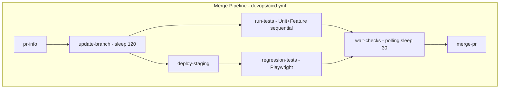
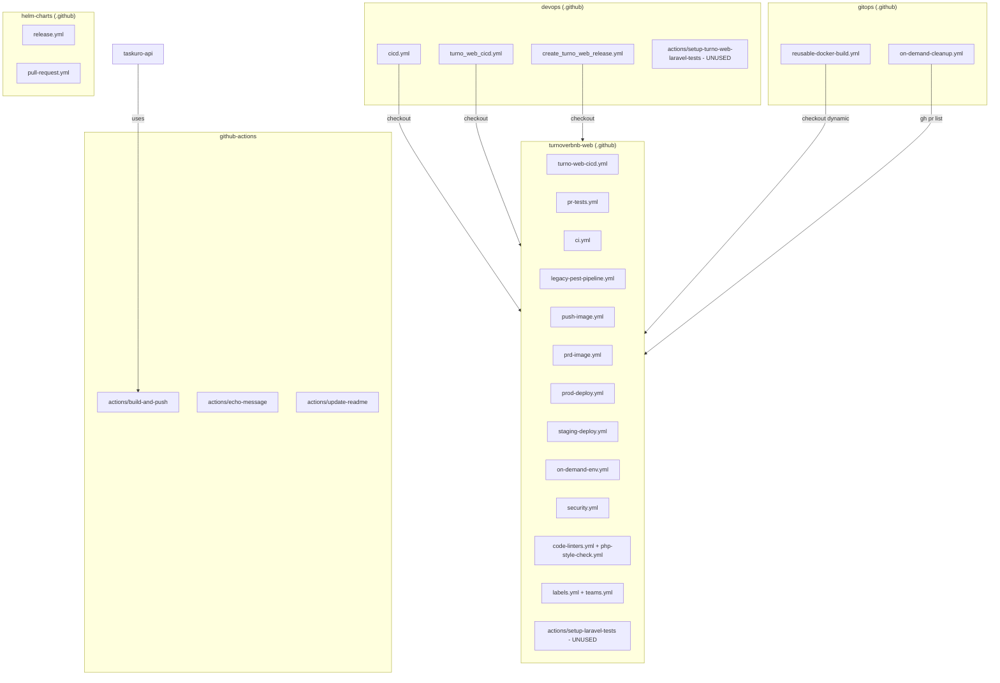
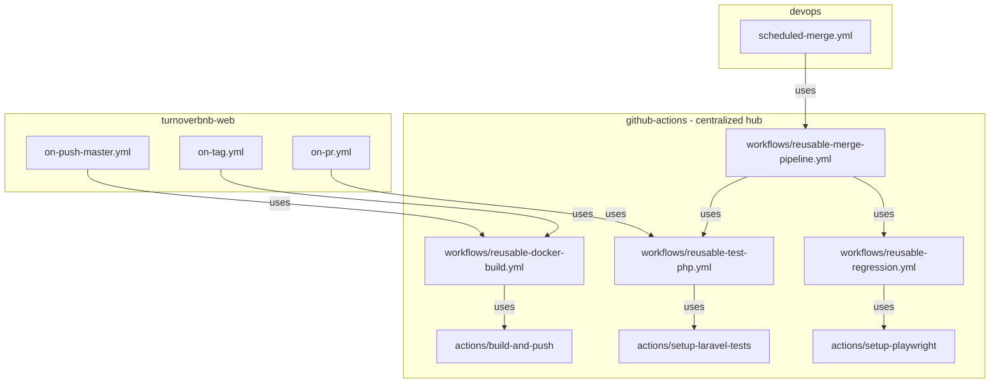
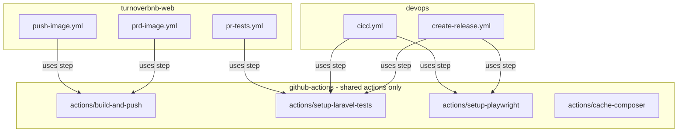
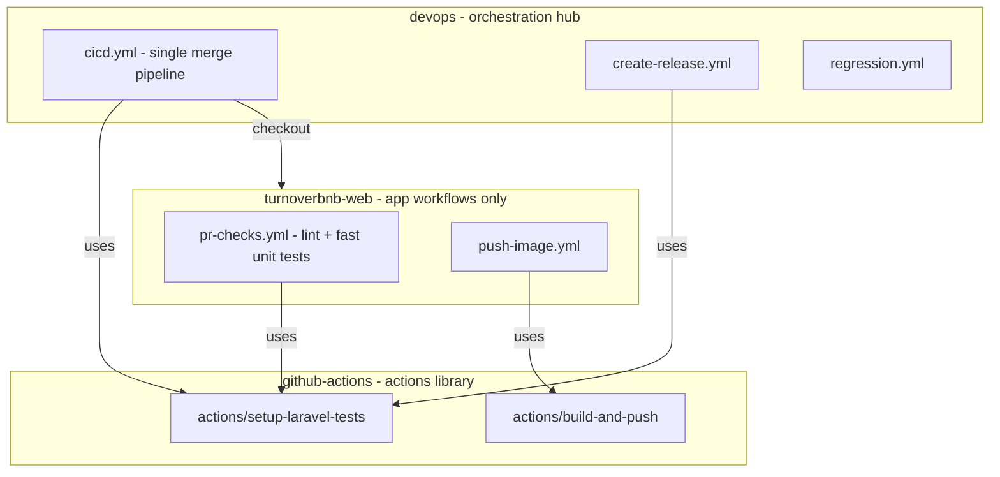
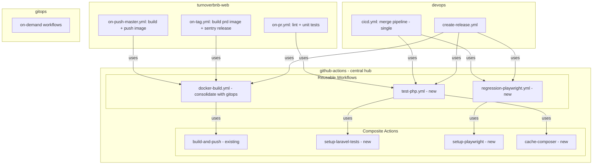
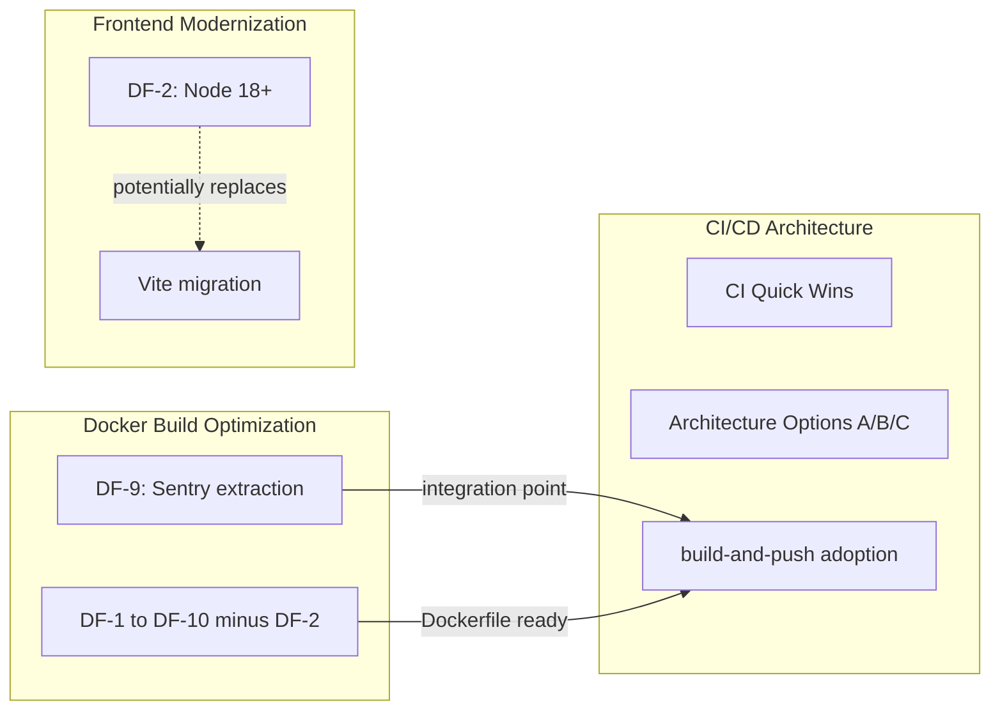

# CI/CD Architecture Decision — turnoverbnb-web

**Owner:** Platform Team
**Timeline:** 3–5 sprints (~3–5 weeks), after pre-requisites are resolved
**Repository scope:** devops, turnoverbnb-web, github-actions, gitops

---

## Overview

The CI/CD pipeline for turnoverbnb-web is fragmented across four repositories with significant duplication, zero dependency caching, and no shared tooling. The result is slow feedback loops, unreliable deploys, and high maintenance burden.

Key problems:
- **3 competing merge pipelines** — `devops/cicd.yml`, `devops/turno_web_cicd.yml`, and `turnoverbnb-web/turno-web-cicd.yml` all claim to handle the merge-to-main flow.
- **3 overlapping test pipelines** — `pr-tests.yml`, `legacy-pest-pipeline.yml`, and `ci.yml` all run on PRs with different configurations.
- **3 sources of Docker builds** — turnoverbnb-web, gitops, and devops each build the same image differently.
- **Zero dependency caching** — Composer (77+ packages) and Playwright (~200MB) are downloaded from scratch on every job.
- **Unused composite actions** — `setup-laravel-tests` exists in both devops and turnoverbnb-web but is referenced by zero workflows.
- **Critical deploy bug** — `deploy-production` does not wait for all test shards to complete.

This document covers the CI/CD quick wins (CI-1 through CI-10), the architectural options for consolidation, and a migration roadmap.

### Related Documents

- [Docker Build Optimization](docker-build-optimization.md) — Dockerfile fixes (DF-1 through DF-10 excluding DF-2)
- [Frontend Build Modernization](frontend-build-modernization.md) — Node upgrade and Vite migration (DF-2)

---

## Pre-requisites (Blockers)

These must be resolved before starting the architecture migration (Sprints 3–4). Quick wins (Sprints 1–2) can proceed without them.

### B1: Identify the canonical merge pipeline

Three workflows claim to handle merge-to-main. Only one is actually active. Cross-reference the last 30 days of workflow runs in the GitHub Actions tab for:
- `devops/.github/workflows/cicd.yml`
- `devops/.github/workflows/turno_web_cicd.yml`
- `turnoverbnb-web/.github/workflows/turno-web-cicd.yml`

**Action:** Platform team to run `gh run list --workflow=<name> --limit=30` for each workflow across both repos and document which one actually triggers on merges.

**Deliverable:** ADR documenting the canonical pipeline and deprecation plan for the others.

### B2: Confirm runner type — ephemeral or persistent?

Cache strategy for all CI-* items depends on runner lifecycle:
- **Ephemeral runners:** `actions/cache` works (stored externally), but Docker layer cache does not persist. BuildKit cache must use registry mode.
- **Persistent runners:** Docker layer cache persists but may become stale. Requires periodic cleanup.

**Action:** Platform team to run `docker info` on `gcp-gh-runner` and verify whether `/var/lib/docker` survives between workflow runs.

---

## Current State

### CI/CD Pipeline (devops/cicd.yml)



### Multi-Repository Landscape



### Overlap Matrix

| Function | Workflow 1 | Workflow 2 | Workflow 3 |
|----------|-----------|-----------|-----------|
| Merge pipeline | devops/cicd.yml | devops/turno_web_cicd.yml | turnoverbnb-web/turno-web-cicd.yml |
| PR tests | turnoverbnb-web/pr-tests.yml | turnoverbnb-web/legacy-pest-pipeline.yml | turnoverbnb-web/ci.yml |
| Image build | turnoverbnb-web/push-image.yml | turnoverbnb-web/prd-image.yml | turnoverbnb-web/push-imagem-prd.yml (commented) |

---

## Quick Wins

These are executable without waiting for the architectural decision.

### CI-7: `deploy-production` does not depend on shard-2 and shard-3 — CRITICAL BUG

**File:** `devops/.github/workflows/create_turno_web_release.yml`

**Problem:** `deploy-production` has `needs: [regression-tests, run-unit-tests, run-feature-tests, run-feature-tests-shard-1, validate-last-commit-checks]` but does NOT include `run-feature-tests-shard-2` and `run-feature-tests-shard-3`. Production deploy can start before all test shards finish.

**Break risk:** None — this is a mandatory fix.

**Fix:** Add `run-feature-tests-shard-2` and `run-feature-tests-shard-3` to the `needs` array of `deploy-production`.

---

### CI-10: Hardcoded credentials — SECURITY

**Files:**
- `testing-docker-compose.local.yml` line 21: `ghp_...` GitHub token hardcoded in `COMPOSER_AUTH`
- `.npmrc`: FontAwesome Pro token `490CC2E1-4A77-41B6-9D05-37BB772B4CC6`

**Break risk:** None.

**Fix:** Rotate tokens and move to GitHub secrets. Before rotating, run `gh search code` across the org for the token prefix to map all consumers.

---

### CI-1: `sleep 120` hardcoded in update-branch

**File:** `devops/.github/workflows/cicd.yml` line 239

**Problem:** After merging the target branch into the source and pushing, the pipeline waits 2 minutes unconditionally.

**Break risk:** Medium — removing the sleep without a replacement may cause subsequent jobs to pick up the wrong commit status.

**Fix:**

```yaml
- name: Wait for commit to be ready
  run: |
    for i in $(seq 1 30); do
      STATUS=$(gh api repos/$REPO/commits/$SHA/status --jq '.state')
      [ "$STATUS" != "pending" ] && break
      sleep 5
    done
```

**Estimated impact:** -1.5 to 2 min

---

### CI-2: Zero dependency caching across all test workflows

**Files:** `devops/cicd.yml`, `devops/create_turno_web_release.yml` (5 parallel jobs), `turnoverbnb-web/pr-tests.yml`, `turnoverbnb-web/ci.yml`

**Problem:** `composer install` runs from scratch on every job. In `create_turno_web_release.yml`, five parallel jobs each download 77+ PHP packages.

**Break risk:** None.

**Fix:**

```yaml
- uses: actions/cache@v4
  with:
    path: vendor
    key: composer-${{ hashFiles('composer.lock') }}
    restore-keys: composer-
```

**Estimated impact:** -2 to 4 min per job

---

### CI-3: Playwright installed without cache and duplicated

**Files:** `devops/cicd.yml` lines 330–358, `devops/create_turno_web_release.yml` lines 421–464

**Problem:** `npm install` + `npx playwright install` + `npm install @playwright/test` execute twice in the same job (once for BE, once for FE). Zero cache for `node_modules` or Playwright binaries (~200MB).

**Break risk:** None.

**Fix:**

```yaml
- uses: actions/cache@v4
  with:
    path: |
      ~/.cache/ms-playwright
      node_modules
    key: playwright-${{ hashFiles('package-lock.json') }}
```

**Estimated impact:** -3 to 5 min per execution

---

### CI-4: Inconsistent Playwright versions

**Problem:**
- `cicd.yml`: `playwright@1.43.0` (pinned)
- `create_turno_web_release.yml`: `playwright@latest` (floating)
- `turno_web_cicd.yml`: `playwright@latest` (floating)

**Break risk:** Low.

**Fix:** Define version as a repository environment variable or a `.playwright-version` file.

**Impact:** Reliability (deterministic tests)

---

### CI-5: Composite action exists but is not used

**Files:** `devops/.github/actions/setup-turno-web-laravel-tests/action.yml` and `turnoverbnb-web/.github/actions/setup-laravel-tests/action.yml`

**Problem:** Neither action is referenced by any workflow. Laravel environment setup (checkout, Docker, Composer, env, config) is repeated manually across ~10 jobs with subtle variations.

**Break risk:** Medium — the actions may be outdated relative to the manual setup. Must sync before adopting.

**Impact:** Maintenance (reduction of ~200 duplicated lines)

---

### CI-6: Unit and Feature tests run sequentially in `cicd.yml`

**File:** `devops/.github/workflows/cicd.yml` lines 303–308

**Problem:** In the `run-tests` job, Unit and Feature run sequentially in the same job. In `create_turno_web_release.yml`, they already run as separate jobs with shards — but this optimization was not applied to the main pipeline.

**Break risk:** Low.

**Fix:** Split `run-tests` into `run-unit-tests` and `run-feature-tests` running in parallel.

**Estimated impact:** -3 to 5 min

---

### CI-9: `docker compose up -d` without `--build` may use stale images

**Files:** All test workflows except `ci.yml`

**Problem:** Without `--build`, `docker compose up -d` uses the cached `sail-8.3/app` image on the runner. If `docker/PHP/Dockerfile` changes, self-hosted runners may use an outdated image.

**Break risk:** Low.

**Impact:** Reliability (always up-to-date test image)

---

## Quick Wins Impact Summary

| ID | Bottleneck | Estimated Savings | Break Risk |
|----|-----------|-------------------|------------|
| CI-6 | Sequential tests | -3 to 5 min | Low |
| CI-3 | Playwright without cache | -3 to 5 min | None |
| CI-2 | Composer without cache | -2 to 4 min/job | None |
| CI-1 | sleep 120 | -1.5 to 2 min | Medium |
| CI-7 | Deploy missing shards in needs | Critical bug | None |
| CI-10 | Hardcoded tokens | Security | None |
| CI-4 | Inconsistent Playwright | Reliability | Low |
| CI-5 | Unused composite action | Maintenance | Medium |
| CI-8 | Duplicate workflows | Maintenance | High |
| CI-9 | Stale test images | Reliability | Low |

---

## Architecture Options

### Option A: Centralized Hub (github-actions)



**Pros:**
- Single source of truth for all CI/CD logic
- Independent versioning (semantic tags, e.g., `setup-laravel-tests-v2`)
- Maximum reuse: any PHP repo can use `reusable-test-php.yml`
- Eliminates 100% of duplication between devops and turnoverbnb-web
- Platform team controls the golden path; developers only configure inputs
- Integration tests for the actions themselves (already exists)
- Release Please already configured for automatic versioning

**Cons:**
- **Change latency:** modifying the pipeline requires a PR to github-actions, a release, and a version bump in consumers
- **Temporal coupling:** if github-actions becomes unavailable (deleted tag, permissions issue), ALL pipelines break
- **Debug complexity:** errors in turnoverbnb-web workflows may originate in github-actions
- **GitHub Actions limits:** reusable workflows have restrictions (max 4 nesting levels, secrets must be passed explicitly, no inherited `concurrency`)
- **Learning curve:** developers need to understand the interface (inputs/outputs) of each reusable workflow

---

### Option B: Workflows in App Repos + Shared Actions Only



**Pros:**
- Workflows live in the repo where they make sense
- Lower coupling: each repo controls its own pipeline
- Composite actions are simpler than reusable workflows (no nesting restrictions)
- Easier debugging: workflow and code are in the same repo
- Fewer breaking changes: updating an action is less impactful than changing a reusable workflow
- Incrementalism: can migrate one action at a time

**Cons:**
- Orchestration logic duplication remains (cicd.yml stays in devops with its own logic)
- No enforced standardization: each repo can diverge in how it uses actions
- Must maintain workflows in 2+ repos
- Does not solve the 3 competing merge pipelines problem

---

### Option C: Monorepo CI/CD in devops + Actions in github-actions



**Pros:**
- Clear separation: devops orchestrates, turnoverbnb-web only has lightweight PR checks
- Single merge pipeline (solves the 3 competing pipelines problem)
- Less context needed: developers only interact with pr-checks.yml
- devops as the central operations hub (already the current pattern)

**Cons:**
- devops becomes a bottleneck: every merge pipeline change requires a devops PR
- Tight coupling: devops must know turnoverbnb-web details (test suites, env vars)
- Cross-repo checkout adds complexity and time
- Does not scale: with 10 apps, devops would have 10 pipelines

---

## Recommendation: Option A (Centralized) with Incremental Migration

### Rationale

1. The `github-actions` repository already exists with infrastructure in place (Release Please, integration tests, templates, CI).
2. The `build-and-push` action already implements the correct pattern (BuildKit cache, metadata, GCP auth) — it is better than the individual workflows in turnoverbnb-web.
3. `gitops/reusable-docker-build.yml` already proves that `workflow_call` works for multi-repo patterns.
4. The core problem (3 merge pipelines, 3 test pipelines) only resolves with real centralization.
5. The platform team can control the golden path and ensure best practices (caching, parallelism, versioning) are applied automatically.

### Target State



**Expected outcome per repository:**
- **turnoverbnb-web:** 3 thin workflows (PR, push master, tag) calling reusable workflows. Zero orchestration logic.
- **devops:** 2 orchestration workflows (merge pipeline, release) calling reusable workflows. No duplicated setup.
- **github-actions:** 4 composite actions + 3 reusable workflows. Single source of truth.
- **gitops:** Migrate `reusable-docker-build.yml` to github-actions or deprecate in favor of the centralized version.

---

## Systemic Risks

### R1: Blast Radius — Batching Too Many Changes

**Risk:** Applying multiple Dockerfile and CI changes simultaneously increases the chance of subtle regressions that only surface in production.

**Probability:** Medium | **Impact:** High

**Mitigation:** Merge PRs one at a time in risk order. Run smoke tests on every PR. Deploy to staging and verify before proceeding to the next change. See [Docker Build Optimization](docker-build-optimization.md) for the PR execution order.

---

### R2: Node 18 Migration Trap

**Risk:** DF-2 (Node 15 → 18) is classified as "High" risk but the actual scope is larger. `fibers`, `node-sass`, `--legacy-peer-deps`, `python2` for `node-gyp`, and `lockfileVersion: 1` indicate the frontend build toolchain is locked to a 2020 ecosystem.

**Probability:** High | **Impact:** High

**Mitigation:** Extracted to a separate track: [Frontend Build Modernization](frontend-build-modernization.md). Evaluate whether to skip Node 18 entirely and go straight to Node 20 + Vite.

---

### R3: Unknown Canonical Pipeline

**Risk:** Three merge pipelines exist but it is not clear which one is active. Starting consolidation (CI-8) without answering this question could disable the actual production pipeline.

**Probability:** High | **Impact:** Critical

**Mitigation:** This is a pre-requisite (B1), not an optional item. Must be resolved before Sprint 3. Cross-reference workflow run history for the last 30 days. Document the answer as an ADR.

---

### R4: Runner Ephemerality

**Risk:** Cache strategies (BuildKit mounts, Docker layer cache, `actions/cache`) behave differently depending on whether runners are ephemeral or persistent. The plan assumes persistent storage but does not confirm.

**Probability:** Medium | **Impact:** High

**Mitigation:** This is a pre-requisite (B2). Verify runner lifecycle before committing to cache strategy. If ephemeral, use registry-based caching. If persistent, add scheduled cleanup.

---

### R5: Single Point of Failure on github-actions Hub

**Risk:** Option A (centralized hub) makes the `github-actions` repository a critical dependency for ALL pipelines. A deleted tag, a bad release, or a permissions issue stops everything simultaneously.

**Probability:** Low | **Impact:** Critical

**Mitigation:**
- Pin production workflows (release, deploy) by SHA, not by tag. Use floating tags (v1, v1.2) only for development workflows (PR checks).
- Enforce branch protection on github-actions: require review from at least 2 platform team members.
- Test releases with a canary consumer (the least critical workflow, e.g., `pr-tests.yml`) before updating deploy/release workflows.
- Document a runbook: "how to revert to inline workflow if github-actions is broken."

---

### R6: Cross-Repository Coordination

**Risk:** Sprints 3–4 require synchronized PRs across github-actions, devops, and turnoverbnb-web. If one PR merges without its counterpart in the other repo, workflows break. There is no atomicity mechanism between repos on GitHub.

**Probability:** High | **Impact:** Medium

**Mitigation:**
- Use feature flags via workflow inputs with conservative defaults. Publish the reusable workflow first (with no consumers), then migrate each consumer in a separate PR.
- Keep the old workflow running in parallel until the new one is validated (dual-running for 1–2 weeks).
- Never delete the old workflow in the same PR that introduces the new one.

---

### R7: Token Rotation with Hidden Consumers

**Risk:** The hardcoded `ghp_...` token in `testing-docker-compose.local.yml` may be used by self-hosted runners that load this file locally. Rotating without mapping all consumers could silently break builds.

**Probability:** Medium | **Impact:** Medium

**Mitigation:**
- Before rotating: grep for the token prefix across all org repos via `gh search code`.
- Create the GitHub secret first, update workflows to use the secret, validate with a test build, and only then revoke the old token.
- For the FontAwesome token: check whether `.npmrc` is copied into the Docker image — if so, the secret must be injected via BuildKit `--secret`.

---

### R8: Prolonged Hybrid State

**Risk:** If migration stalls at Sprint 2, the system is in a hybrid state: some things centralized, some not, with two patterns coexisting indefinitely. This is worse than the original because it adds complexity without eliminating duplication.

**Probability:** Medium | **Impact:** Medium

**Mitigation:**
- Define explicit exit criteria for each sprint. If a sprint is not completed in 2x the estimated time, hold a retrospective and decide: complete, pause with rollback, or accept the partial state as the new baseline.
- Each sprint must deliver independent value (must not depend on the next sprint to make sense).

---

## Integration Points with Docker Build Track



- **DF-9 (Sentry extraction):** Moving Sentry release out of the Docker build creates a new CI step in the workflow. This should be coordinated with the build-and-push action adoption.
- **build-and-push adoption:** Once the Dockerfile is optimized (Doc 1) and the centralized hub is ready (this doc), the `push-image.yml` and `prd-image.yml` workflows should switch to the `build-and-push` action.

---

## Migration Roadmap

### Sprint 1 (1 week): Critical fixes + preparation

**Entry criteria:** None
**Exit criteria:** CI-7 and CI-10 fixed; Composer cache added; pre-requisites B1/B2 answered

| ID | Action | Repo | Risk |
|----|--------|------|------|
| CI-7 | Fix deploy-production needs (add shard-2, shard-3) | devops | None |
| CI-10 | Rotate hardcoded tokens to GitHub secrets | turnoverbnb-web | None |
| CI-2 | Add actions/cache for Composer in all test workflows | devops | None |
| CI-4 | Pin Playwright version across all workflows | devops | Low |
| B1 | Identify canonical merge pipeline (ADR) | devops + turnoverbnb-web | — |
| B2 | Verify runner type (ephemeral vs persistent) | platform | — |

### Sprint 2 (1 week): Test pipeline optimization

**Entry criteria:** Sprint 1 complete; B1 and B2 resolved
**Exit criteria:** Cache hits confirmed; tests running in parallel

| ID | Action | Repo | Risk |
|----|--------|------|------|
| CI-3 | Add Playwright and npm cache | devops | None |
| CI-6 | Split Unit/Feature into parallel jobs in cicd.yml | devops | Low |
| CI-1 | Replace sleep 120 with commit status polling | devops | Medium |
| CI-9 | Add --build to docker compose up in test workflows | devops + turnoverbnb-web | Low |

### Sprint 3 (1–2 weeks): Centralized test infrastructure

**Entry criteria:** Sprint 2 complete; canonical pipeline identified
**Exit criteria:** reusable-test-php.yml working; at least one consumer migrated

| ID | Action | Repo | Risk |
|----|--------|------|------|
| — | Create setup-laravel-tests composite action | github-actions | Medium |
| — | Create reusable-test-php.yml | github-actions | Medium |
| CI-5 | Migrate pr-tests.yml to use reusable workflow | turnoverbnb-web | Medium |
| — | Migrate turnoverbnb-web image builds to build-and-push action | turnoverbnb-web | Low |

### Sprint 4 (1–2 weeks): Pipeline consolidation

**Entry criteria:** Sprint 3 complete; dual-running validated
**Exit criteria:** Single merge pipeline; redundant workflows deprecated

| ID | Action | Repo | Risk |
|----|--------|------|------|
| CI-8 | Consolidate duplicate workflows | devops + turnoverbnb-web | High |
| — | Migrate canonical cicd.yml to use reusable workflows | devops | High |
| — | Create reusable-merge-pipeline.yml | github-actions | High |
| — | Deprecate and disable redundant workflows | devops + turnoverbnb-web | High |

---

## Dockerfile Standardization Recommendation

The `github-actions/actions/build-and-push` already implements:
- BuildKit cache via registry (cache-from/cache-to)
- Docker metadata (tags, labels)
- GCP Workload Identity (no service account key)
- Secrets via BuildKit mounts

Recommendations beyond the DF-* fixes:
1. **Adopt the `build-and-push` action** in `push-image.yml` and `prd-image.yml` — eliminates ~40 duplicated lines of GCP/Docker setup per workflow.
2. **Standardize Dockerfiles** with a template in the github-actions documentation (golden path).
3. **Create a dedicated test Dockerfile** (lighter than production, no Nginx/Sentry) for test jobs, avoiding the Sail docker-compose build.

---

## Handoff to Engineer

- **Decisions:**
  - Option A (centralization in github-actions) as target architecture
  - Incremental migration over 4 sprints to minimize risk
  - Prioritize CI-2 (Composer cache) and CI-3 (Playwright cache) as highest immediate ROI
  - Node upgrade (DF-2) in a separate track with its own spike
  - Keep devops as merge pipeline orchestrator, but with logic delegated to reusable workflows
- **Artifacts:** This document, architecture diagrams, per-repository action lists
- **Constraints:**
  - Do not break the production pipeline at any point
  - Token rotation must map all consumers before revoking
  - Maintain compatibility with self-hosted runners (gcp-gh-runner)
  - FontAwesome token must be preserved but moved to GitHub secret
- **Blockers (must resolve before Sprint 3):**
  1. Which merge pipeline is the canonical one? (`devops/cicd.yml` vs `devops/turno_web_cicd.yml` vs `web/turno-web-cicd.yml`)
  2. Are self-hosted runners ephemeral or persistent?
- **Open questions (non-blocking):**
  3. Does `php artisan export:messages-flat` depend on files beyond `vendor/`?
  4. Are there automated tests to validate webpack output?
  5. Is `gitops/reusable-docker-build.yml` actively used or experimental?
  6. Are there plans to add more apps to the centralized pipeline beyond turnoverbnb-web?

---

## Jira Hierarchy Suggestion

### Initiative: CI/CD Pipeline Modernization — turnoverbnb-web

Consolidate fragmented CI/CD across devops, turnoverbnb-web, github-actions, and gitops into a centralized, cacheable, maintainable pipeline architecture.

### Epic 1: CI/CD Quick Wins

Zero-to-low risk improvements that can ship independently of the architecture decision.

- **Story: Fix critical deploy bug and security issues (CI-7, CI-10)**
  - Task: Add shard-2/shard-3 to deploy-production needs
  - Task: Rotate GitHub token from testing-docker-compose.local.yml to GitHub secret
  - Task: Move FontAwesome token from .npmrc to GitHub secret

- **Story: Add dependency caching to all test workflows (CI-2, CI-3)**
  - Task: Add Composer cache to devops/cicd.yml
  - Task: Add Composer cache to devops/create_turno_web_release.yml
  - Task: Add Playwright cache to regression jobs
  - Task: Standardize Playwright version across all workflows (CI-4)

- **Story: Optimize test execution time (CI-1, CI-6)**
  - Task: Replace sleep 120 with commit status polling in cicd.yml
  - Task: Split Unit and Feature into parallel jobs in cicd.yml

### Epic 2: Centralize CI/CD in github-actions (Option A)

Migrate shared CI/CD logic to reusable workflows and composite actions in the github-actions repository.

- **Story: Create setup-laravel-tests composite action**
  Consolidate the two existing unused composite actions into a single, tested action in github-actions.
  - Task: Audit devops and turnoverbnb-web composite actions for differences
  - Task: Implement consolidated action with inputs for customization
  - Task: Add integration tests

- **Story: Create reusable-test-php workflow**
  - Task: Define workflow inputs (PHP version, test suite, parallelism)
  - Task: Implement workflow calling setup-laravel-tests and cache-composer actions
  - Task: Add matrix support for test sharding

- **Story: Migrate pr-tests.yml to reusable workflow**
  - Task: Update turnoverbnb-web/pr-tests.yml to call reusable-test-php
  - Task: Validate test results match the old workflow
  - Task: Monitor for 1 week before removing old workflow

- **Story: Consolidate merge pipelines into single canonical workflow**
  - Task: Document canonical pipeline (ADR from B1)
  - Task: Migrate canonical cicd.yml to use reusable workflows
  - Task: Add deprecation comments to non-canonical workflows
  - Task: Disable non-canonical workflows after 2-week validation

- **Story: Deprecate and remove redundant workflows (CI-8)**
  - Task: Catalog all active workflows and their triggers
  - Task: Disable redundant workflows one at a time with 1-week monitoring
  - Task: Remove disabled workflows after confirming no impact
