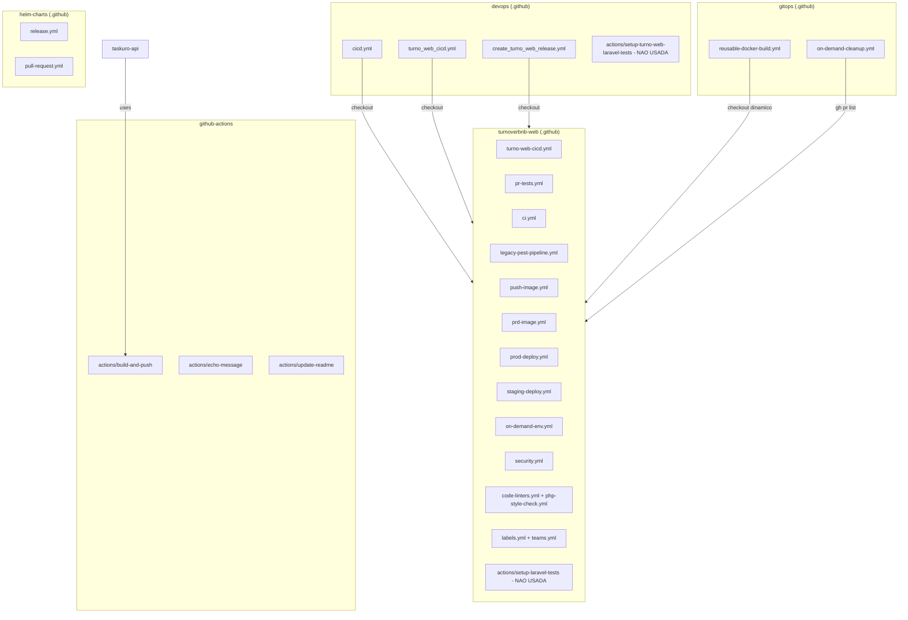
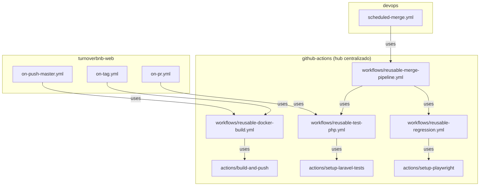
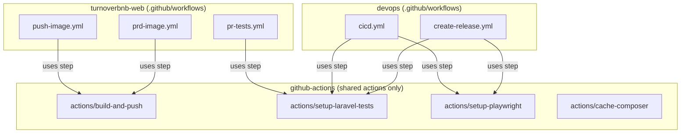
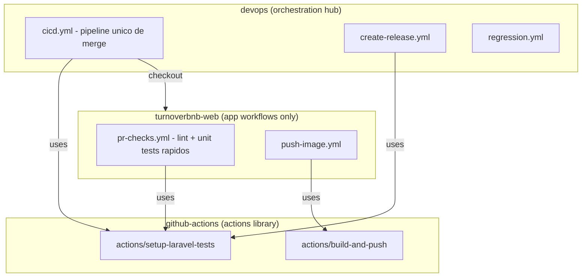
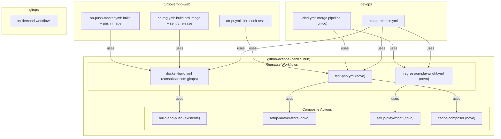

# Analise de Gargalos do CI/CD - turnoverbnb-web

> **ARCHIVED** — This document has been restructured into three independent tracks:
>
> 1. [Docker Build Optimization](docker-build-optimization.md) — DF-1 through DF-10 (excluding DF-2), with smoke tests, PR order, acceptance criteria, and systemic risks.
> 2. [CI/CD Architecture Decision](cicd-architecture-decision.md) — CI-1 through CI-10, architecture options A/B/C, systemic risks R1–R8, migration roadmap, and Jira hierarchy.
> 3. [Frontend Build Modernization](frontend-build-modernization.md) — DF-2 (Node upgrade) and Vite migration, with spike definition and go/no-go framework.
>
> Refer to the documents above for the latest version. This file is preserved as the original analysis reference.

## Diagrama do Pipeline Atual

```mermaid
flowchart TD
    subgraph dockerBuild [Docker Build - Producao]
        goStage["Stage: go - golang:1.21-alpine - CODIGO MORTO"]
        composerStage["Stage: composer - composer:2.6"]
        builderStage["Stage: builder - PHP 8.3 Alpine"]
        nodeStage["Stage: node - ubuntu:22.04 + NVM + Node 15 EOL"]
        prodStage["Stage: production"]

        goStage -.->|"nunca copiado"| prodStage
        composerStage --> builderStage
        builderStage --> nodeStage
        builderStage --> prodStage
        nodeStage -->|"COPY public/"| prodStage
    end

    subgraph ciPipeline [Pipeline CI/CD - devops/cicd.yml]
        prInfo["pr-info"]
        updateBranch["update-branch - sleep 120"]
        runTests["run-tests - Unit+Feature sequencial"]
        deploySt["deploy-staging"]
        regressionTests["regression-tests - Playwright"]
        waitChecks["wait-checks - polling sleep 30"]
        mergePR["merge-pr"]

        prInfo --> updateBranch
        updateBranch --> runTests
        updateBranch --> deploySt
        deploySt --> regressionTests
        runTests --> waitChecks
        regressionTests --> waitChecks
        waitChecks --> mergePR
    end
```




---

# PARTE 1: DOCKERFILE

## Gargalos Confirmados

### DF-1: `COPY . .` antes de `composer install` invalida cache de deps PHP - CONFIRMADO

**Arquivo:** [docker/production/Dockerfile](turnoverbnb-web/docker/production/Dockerfile) linhas 73-93

**Problema:** O codigo inteiro (77 pacotes require + codigo app) e copiado antes de `composer install`. Qualquer mudanca em qualquer arquivo `.php` invalida o cache dessa layer e forca re-download de TODOS os pacotes.

**Evidencia:** `composer.json` tem 77 pacotes em `require` + 14 em `require-dev`. Inclui pacotes pesados: `aws/aws-sdk-php`, `google/apiclient`, `filament/filament`, `mongodb/laravel-mongodb`, `maatwebsite/excel`.

**Risco de quebra ao corrigir:**

- `php artisan export:messages-flat` roda apos `composer install` e precisa do codigo da app. Se mover o `COPY .` para depois do `composer install`, este comando pode falhar se depender de arquivos fora de `vendor/`.
- O `auth.json` com o GitHub token precisa existir ANTES do `composer install` (ja esta correto).
- `barryvdh/laravel-ide-helper` esta em `require` (producao) em vez de `require-dev`. Isso forca o download de um pacote desnecessario em prod.

**Workaround:**

```dockerfile
# 1. Copiar apenas arquivos de dependencia
COPY --chown=www-data:www-data composer.json composer.lock ./
# 2. Instalar dependencias (layer cacheavel)
RUN composer install --no-dev --optimize-autoloader --prefer-dist --no-interaction --no-scripts
# 3. Copiar codigo da app
COPY --chown=www-data:www-data . .
# 4. Rodar post-install scripts e artisan commands
RUN composer dump-autoload -o && php artisan export:messages-flat
```

**Impacto estimado:** -1 a 3 min quando so muda codigo (nao deps)

---

### DF-2: Stage Node usa ubuntu:22.04 + NVM + Node 15 (EOL) - CONFIRMADO

**Arquivo:** [docker/production/Dockerfile](turnoverbnb-web/docker/production/Dockerfile) linhas 100-160

**Problema:**

- `ubuntu:22.04` como base instala ~500MB de pacotes apt (python2, python3, make, g++, build-essential)
- NVM adiciona overhead de instalacao
- Node `v15.14.0` esta em EOL desde junho 2021
- `NODE_OPTIONS="--max-old-space-size=8192"` (8GB) e excessivo para este build
- `npm_config_python=/usr/bin/python2` indica dependencias nativas antigas

**Evidencia:** `package.json` tem `lockfileVersion: 1` (formato npm v5/v6), 107 dependencies + 51 devDependencies. Dependencias com bindings nativos: `node-sass` (via `sass-loader`), `fibers`.

**Risco de quebra ao corrigir:**

- **ALTO**: `--legacy-peer-deps` e necessario no `npm ci` por conflitos entre Vue 2, Vuetify 2 e Laravel Mix 6. Upgrade de Node pode expor conflitos ocultos.
- **ALTO**: `fibers` (dependencia de `sass-loader` com `node-sass`) pode nao compilar em Node 18+. Precisaria migrar para `dart-sass`.
- **MEDIO**: Algumas dependencias podem nao suportar Node 18+ (ex.: `@storybook` versao antiga, `jest` antigo).
- **BAIXO**: `python2` e necessario para compilacao de modulos nativos via `node-gyp`. Em Node 18+, `node-gyp` usa Python 3.

**Workaround:** Testar com `node:18-bullseye` (nao Alpine, para manter compatibilidade com bindings nativos):

```dockerfile
FROM node:18-bullseye AS node
RUN apt-get update && apt-get install -y python3 make g++ && rm -rf /var/lib/apt/lists/*
```

**Impacto estimado:** -1 a 2 min no tempo de build + reducao de ~300MB na imagem do stage

---

### DF-3: Webpack cache desabilitado em producao (391s) - CONFIRMADO

**Arquivo:** [webpack.mix.js](turnoverbnb-web/webpack.mix.js) linhas 36-41

**Problema:** `cache: mix.inProduction() ? false : { type: "filesystem" }`. O build compila 7 entry points JS + 1 SASS do zero a cada build, sem cache.

**Evidencia adicional:**

- [webpack.mix.dashboard.js](turnoverbnb-web/webpack.mix.dashboard.js): 7 entry points JS com Vue + Vuetify (pesados)
- `uglify: { parallel: 8 }` configurado no Mix, MAS o Webpack 5 ja usa `terser-webpack-plugin` internamente - possivel dupla minificacao
- `uglifyjs-webpack-plugin` em `package.json` + `terser-webpack-plugin` como dep transitiva do Webpack 5 = conflito

**Risco de quebra ao corrigir:**

- **BAIXO**: Habilitar filesystem cache nao muda o output; apenas reutiliza resultados anteriores. Porem, dentro do Docker build cada layer e isolada - o cache precisa ser montado como BuildKit cache mount.
- **MEDIO**: Remover `uglifyjs-webpack-plugin` pode mudar levemente o output JS minificado. Precisa validar que o Terser produz output equivalente.

**Workaround:**

```javascript
// webpack.mix.js - habilitar cache sempre
cache: {
    type: "filesystem",
    buildDependencies: {
        config: [__filename],
    }
}
```

```dockerfile
# Dockerfile - montar cache persistente com BuildKit
RUN --mount=type=cache,target=/var/www/html/node_modules/.cache \
    npm run prod
```

**Impacto estimado:** -4 a 5 min (de 391s para ~60-90s em builds incrementais)

---

### DF-4: Stage `go` e codigo morto - CONFIRMADO

**Arquivo:** [docker/production/Dockerfile](turnoverbnb-web/docker/production/Dockerfile) linhas 4-8

**Problema:** O stage `go` compila `s5cmd`, mas:

1. NAO ha `COPY --from=go` no stage `production`
2. O binario `s5cmd` NAO e usado em nenhum arquivo PHP, shell ou config do repositorio
3. O codigo usa `s3cmd` (nao `s5cmd`) em `app/Console/Commands/RestoreBackup.php`
4. No `docker/PHP/Dockerfile` (dev), o Go e s5cmd sao copiados mas tambem nao sao usados

**Risco de quebra ao corrigir:** NENHUM. O stage e completamente isolado e nao contribui para a imagem final.

**Workaround:** Remover as linhas 1-8 do Dockerfile de producao.

**Impacto estimado:** -10-20s + reducao de complexidade

---

### DF-5: `chown -R` recursivo no stage production - NOVO

**Arquivo:** [docker/production/Dockerfile](turnoverbnb-web/docker/production/Dockerfile) linha ~200

```dockerfile
RUN chown -R www-data:www-data /var/www/html && \
    chmod -R 755 /var/www/html/storage /var/www/html/bootstrap/cache
```

**Problema:** `chown -R` percorre TODOS os arquivos do projeto (incluindo vendor/ com ~77 pacotes). Isso e lento e cria uma layer extra grande.

**Risco de quebra ao corrigir:**

- **BAIXO**: Se o COPY anterior ja usa `--chown=www-data:www-data`, os arquivos ja tem o owner correto. So e necessario ajustar `storage/` e `bootstrap/cache/`.

**Workaround:**

```dockerfile
RUN chmod -R 755 /var/www/html/storage /var/www/html/bootstrap/cache
```

**Impacto estimado:** -10-30s

---

### DF-6: `.env` pode vazar para o build context - NOVO

**Arquivo:** [.dockerignore](turnoverbnb-web/.dockerignore) linhas 13-16

```dockerignore
#.env
#.env.*
!.env.example
```

**Problema:** As exclusoes de `.env` estao COMENTADAS. Se um arquivo `.env` existir no diretorio de build (ex.: runner self-hosted com estado persistente), ele entra no Docker context e potencialmente na imagem.

**Risco de quebra ao corrigir:** NENHUM. `.env` nao deve estar no build context.

**Workaround:** Descomentar as linhas:

```dockerignore
.env
.env.*
!.env.example
```

**Impacto:** Seguranca (prevencao de vazamento de secrets)

---

### DF-7: `COPY . .` no stage Node copia arquivos desnecessarios - NOVO

**Arquivo:** [docker/production/Dockerfile](turnoverbnb-web/docker/production/Dockerfile) linha 151

**Problema:** `COPY . .` copia TUDO para o stage Node, mas o `npm run prod` so precisa de:

- `resources/assets/` (JS/CSS source)
- `webpack.mix.js`, `webpack.mix.dashboard.js`
- `package.json` (ja copiado)

Copiar o codigo PHP inteiro invalida o cache dessa layer a cada mudanca de codigo backend.

**Risco de quebra ao corrigir:**

- **MEDIO**: O webpack pode resolver paths relativos que dependam da estrutura de diretorios. Precisa testar se o build funciona com COPY seletivo.
- Os aliases no webpack.mix.js apontam para `resources/assets/js/` - precisa garantir que esse diretorio esteja presente.

**Workaround:**

```dockerfile
COPY webpack.mix.js webpack.mix.dashboard.js webpack.mix.marketing.js webpack.mix.public-cleaners.js ./
COPY resources/ resources/
COPY public/ public/
```

**Impacto estimado:** Melhora cache hit do `npm run prod` quando so mudam arquivos PHP

---

### DF-8: Conflito UglifyJS + Terser (dupla minificacao) - NOVO

**Arquivo:** [webpack.mix.dashboard.js](turnoverbnb-web/webpack.mix.dashboard.js)

**Problema:** `uglifyjs-webpack-plugin` esta configurado com `parallel: 8`, mas Webpack 5 (via Laravel Mix 6) ja usa `terser-webpack-plugin` internamente. Isso pode causar:

- Dupla minificacao (JS processado duas vezes)
- Conflitos de plugins
- Tempo de build extra

**Risco de quebra ao corrigir:**

- **BAIXO**: Terser e o successor do UglifyJS e produz output equivalente ou melhor. A remocao do UglifyJS plugin pode mudar levemente o tamanho dos bundles mas nao afeta funcionalidade.

**Workaround:** Remover `uglifyjs-webpack-plugin` do `package.json` e a configuracao `uglify: { parallel: 8 }` dos webpack.mix files.

**Impacto estimado:** -30-60s no build + reducao de deps

---

### DF-9: Sentry release management no Docker build (2-5 min) - NOVO

**Arquivo:** [docker/production/Dockerfile](turnoverbnb-web/docker/production/Dockerfile) linhas 155-185 e [docker/production/tools/sentry.sh](turnoverbnb-web/docker/production/tools/sentry.sh)

**Problema:** Quando `SENTRY_RELEASE_ENABLED=1` (build de producao via `prd-image.yml`):

1. Instala Sentry CLI via npm (`@sentry/cli@2.57.0`) - ~30-60s
2. Cria releases em 2 projetos (laravel + vue)
3. Injeta debug IDs nos sourcemaps
4. Faz upload de sourcemaps
5. Finaliza releases

Tudo isso acontece DENTRO do Docker build, bloqueando o builder.

**Risco de quebra ao corrigir:**

- **MEDIO**: Mover o Sentry release para um step separado no GitHub Actions (pos-build) requer que os sourcemaps estejam disponiveis fora do container. Pode extrair do container apos build.

**Workaround:** Mover para um job separado no workflow:

```yaml
- name: Extract sourcemaps
  run: docker cp $(docker create $IMAGE):/var/www/html/public ./public-assets
- name: Sentry release
  run: ./docker/production/tools/sentry.sh $BUILD_TAG
```

**Impacto estimado:** -2 a 5 min no build Docker (move para step paralelo)

---

### DF-10: `barryvdh/laravel-ide-helper` em require (producao) - NOVO

**Arquivo:** [composer.json](turnoverbnb-web/composer.json)

**Problema:** `barryvdh/laravel-ide-helper` esta em `require` (producao) em vez de `require-dev`. Isso faz o pacote ser instalado em producao e no build Docker (que usa `--no-dev`).

**Correção:** O `composer install --no-dev` JA exclui este pacote? NAO - ele esta em `require`, nao em `require-dev`, entao e instalado. Mover para `require-dev` e tambem refletido no `config/app.php` onde `IdeHelperServiceProvider` esta registrado.

**Risco de quebra ao corrigir:**

- **MEDIO**: Se o provider e carregado condicionalmente (com `APP_ENV=local`), mover para `require-dev` pode causar classe nao encontrada em producao. Verificar se ha condicional no service provider.
- O `composer.json` mostra scripts `post-autoload-dump` que chamam `ide-helper:generate` e `ide-helper:meta` apenas quando `APP_ENV=local`.

**Workaround:** Mover para `require-dev` e adicionar condicional no `config/app.php`.

**Impacto:** Reducao de ~2-5 pacotes e tempo de `composer install`

---

## Resumo de Impacto - Dockerfile


| ID    | Gargalo                         | Tempo estimado    | Risco de quebra |
| ----- | ------------------------------- | ----------------- | --------------- |
| DF-3  | Webpack cache desabilitado      | -4 a 5 min        | Baixo           |
| DF-1  | Composer COPY antes de deps     | -1 a 3 min        | Medio           |
| DF-9  | Sentry no Docker build          | -2 a 5 min        | Medio           |
| DF-2  | Node 15 + ubuntu + NVM          | -1 a 2 min        | Alto            |
| DF-8  | Dupla minificacao Uglify+Terser | -30 a 60s         | Baixo           |
| DF-5  | chown -R recursivo              | -10 a 30s         | Baixo           |
| DF-4  | Stage go morto                  | -10 a 20s         | Nenhum          |
| DF-7  | COPY seletivo no stage node     | Cache improvement | Medio           |
| DF-6  | .env no build context           | Seguranca         | Nenhum          |
| DF-10 | ide-helper em producao          | Marginal          | Medio           |


**Economia total estimada: 9 a 17 minutos**

---

# PARTE 2: CI/CD

## Gargalos Confirmados

### CI-1: `sleep 120` hardcoded em update-branch - CONFIRMADO

**Arquivo:** [devops/.github/workflows/cicd.yml](devops/.github/workflows/cicd.yml) linha 239

**Problema:** Apos merge do target branch no source e push, o pipeline espera 2 minutos fixos. Este sleep existe provavelmente para dar tempo aos status checks do commit serem registrados, mas e uma abordagem fragil e lenta.

**Risco de quebra ao corrigir:**

- **MEDIO**: Se o sleep for removido sem substituicao, os jobs subsequentes podem pegar o commit errado ou iniciar antes dos checks estarem prontos.

**Workaround:** Substituir por polling do commit status via API:

```yaml
- name: Wait for commit to be ready
  run: |
    for i in $(seq 1 30); do
      STATUS=$(gh api repos/$REPO/commits/$SHA/status --jq '.state')
      [ "$STATUS" != "pending" ] && break
      sleep 5
    done
```

**Impacto estimado:** -1.5 a 2 min

---

### CI-2: Zero cache de dependencias em TODOS os workflows de teste - CONFIRMADO

**Arquivos:**

- [devops/.github/workflows/cicd.yml](devops/.github/workflows/cicd.yml) - `composer install` sem cache
- [devops/.github/workflows/create_turno_web_release.yml](devops/.github/workflows/create_turno_web_release.yml) - `composer install` x5 jobs sem cache
- [turnoverbnb-web/.github/workflows/pr-tests.yml](turnoverbnb-web/.github/workflows/pr-tests.yml) - `composer install` sem flags e sem cache
- [turnoverbnb-web/.github/workflows/ci.yml](turnoverbnb-web/.github/workflows/ci.yml) - so faz cache de `clover.xml` (coverage)

**Problema:** `composer install --no-progress --no-scripts` executado do zero em CADA job. No `create_turno_web_release.yml`, sao 5 jobs paralelos, cada um fazendo download completo de 77+ pacotes PHP.

**Evidencia:** Nenhum uso de `actions/cache` para `vendor/` em qualquer workflow. O unico cache e de `clover.xml` no `ci.yml`.

**Risco de quebra ao corrigir:** NENHUM. Cache de Composer e uma pratica padrao.

**Workaround:**

```yaml
- uses: actions/cache@v4
  with:
    path: vendor
    key: composer-${{ hashFiles('composer.lock') }}
    restore-keys: composer-
```

**Impacto estimado:** -2 a 4 min por job (download de ~77 pacotes)

---

### CI-3: Playwright instalado sem cache e DUPLICADO - CONFIRMADO

**Arquivos:**

- [devops/.github/workflows/cicd.yml](devops/.github/workflows/cicd.yml) linhas 330-358
- [devops/.github/workflows/create_turno_web_release.yml](devops/.github/workflows/create_turno_web_release.yml) linhas 421-464

**Problema:**

1. `npm install` + `npx playwright install` + `npm install @playwright/test` executados DUAS vezes no mesmo job (uma para BE, outra para FE)
2. Zero cache de `node_modules` ou binarios do Playwright (~200MB)
3. `npx playwright install-deps` (apt packages) executado no FE sem cache

**Risco de quebra ao corrigir:** NENHUM. Cache de Playwright e uma pratica padrao.

**Workaround:**

```yaml
- uses: actions/cache@v4
  with:
    path: |
      ~/.cache/ms-playwright
      node_modules
    key: playwright-${{ hashFiles('package-lock.json') }}
```

**Impacto estimado:** -3 a 5 min por execucao

---

### CI-4: Versoes inconsistentes do Playwright - CONFIRMADO

**Problema:**

- `cicd.yml`: `playwright@1.43.0` (fixo)
- `create_turno_web_release.yml`: `playwright@latest` (flutuante)
- `turno_web_cicd.yml`: `playwright@latest` (flutuante)

**Risco de quebra ao corrigir:**

- **BAIXO**: Fixar a versao pode exigir atualizacao dos testes se a versao atual dos testes depende de features mais novas.

**Workaround:** Definir versao como variavel de ambiente no repositorio ou em um arquivo `.playwright-version`.

**Impacto:** Confiabilidade (testes deterministicos)

---

### CI-5: Composite action existe mas NAO e usada - CONFIRMADO

**Arquivos:**

- `devops/.github/actions/setup-turno-web-laravel-tests/action.yml` - existe
- `turnoverbnb-web/.github/actions/setup-laravel-tests/action.yml` - existe

**Problema:** Nenhum workflow referencia estas actions. O setup de ambiente Laravel (checkout, Docker, Composer, env, config) e repetido manualmente em ~10 jobs diferentes com variacoes sutis.

**Risco de quebra ao corrigir:**

- **MEDIO**: As actions podem estar desatualizadas em relacao ao setup manual atual. Precisa sincronizar antes de adotar.

**Workaround:** Atualizar a composite action e substitui-la em um workflow por vez, comecando pelos mais simples.

**Impacto:** Manutencao (reducao de ~200 linhas duplicadas)

---

### CI-6: Testes Unit + Feature sequenciais em `cicd.yml` - CONFIRMADO

**Arquivo:** [devops/.github/workflows/cicd.yml](devops/.github/workflows/cicd.yml) linhas 303-308

**Problema:** No job `run-tests`, Unit e Feature rodam sequencialmente no MESMO job. No `create_turno_web_release.yml`, ja existem jobs separados + shards para Feature tests - mas essa otimizacao nao foi aplicada ao pipeline principal.

**Risco de quebra ao corrigir:**

- **BAIXO**: Separar em jobs independentes requer duplicar o setup, mas com a composite action seria trivial.

**Workaround:** Dividir `run-tests` em `run-unit-tests` e `run-feature-tests` em paralelo.

**Impacto estimado:** -3 a 5 min (Feature e Unit rodam em paralelo)

---

### CI-7: `deploy-production` nao depende de shard-2 e shard-3 - CONFIRMADO (BUG)

**Arquivo:** [devops/.github/workflows/create_turno_web_release.yml](devops/.github/workflows/create_turno_web_release.yml)

**Problema:** O job `deploy-production` tem `needs: [regression-tests, run-unit-tests, run-feature-tests, run-feature-tests-shard-1, validate-last-commit-checks]` mas NAO inclui `run-feature-tests-shard-2` e `run-feature-tests-shard-3`. Deploy para producao pode ocorrer ANTES desses shards terminarem.

**Risco de quebra ao corrigir:** NENHUM - corrigir e obrigatorio.

**Nota:** `validate-last-commit-checks` depende de todos os shards, mas se ele passar por status check e nao por conclusao dos jobs, o deploy pode iniciar prematuramente.

**Workaround:** Adicionar `run-feature-tests-shard-2` e `run-feature-tests-shard-3` ao `needs` de `deploy-production`.

**Impacto:** Confiabilidade (prevencao de deploy sem testes completos)

---

### CI-8: Workflows duplicados e sobrepostos - CONFIRMADO

**Evidencia de sobreposicao:**


| Funcao            | Workflow 1                     | Workflow 2                               | Workflow 3                                      |
| ----------------- | ------------------------------ | ---------------------------------------- | ----------------------------------------------- |
| Pipeline de merge | devops/cicd.yml                | devops/turno_web_cicd.yml                | turnoverbnb-web/turno-web-cicd.yml              |
| Testes em PR      | turnoverbnb-web/pr-tests.yml   | turnoverbnb-web/legacy-pest-pipeline.yml | turnoverbnb-web/ci.yml                          |
| Build de imagem   | turnoverbnb-web/push-image.yml | turnoverbnb-web/prd-image.yml            | turnoverbnb-web/push-imagem-prd.yml (comentado) |


**Risco de quebra ao corrigir:**

- **ALTO**: Consolidar workflows requer entender qual versao e a "correta" e migrar gradualmente. Desativar o errado pode parar o pipeline.

**Workaround:** Mapear qual workflow esta efetivamente ativo (via schedules e triggers), deprecar os outros com comentario, e consolidar iterativamente.

**Impacto:** Manutencao (de ~18 workflows para ~6-8)

---

### CI-9: `docker compose up -d` sem `--build` pode usar imagem stale - NOVO

**Arquivos:** Todos os workflows de teste exceto `ci.yml` (test-and-check-coverage)

**Problema:** `docker compose up -d` sem `--build` usa a imagem `sail-8.3/app` em cache no runner. Se o `docker/PHP/Dockerfile` mudar, os runners self-hosted podem usar uma imagem desatualizada ate que alguem faca `docker compose build` manualmente.

**Evidencia:** Apenas `ci.yml` (job test-and-check-coverage) usa `up --build -d`. Todos os outros assumem que a imagem ja existe.

**Risco de quebra ao corrigir:**

- **BAIXO**: Adicionar `--build` aumenta o tempo se nao houver cache de layers. Porem, com cache local no runner, o overhead e minimo.

**Workaround:** Pre-build a imagem de teste como artifact ou usar `docker compose build` como step separado com cache.

**Impacto:** Confiabilidade (imagem sempre atualizada)

---

### CI-10: Credenciais hardcoded - CONFIRMADO (SEGURANCA)

**Arquivos:**

- `testing-docker-compose.local.yml` linha 21: `ghp_...` token do GitHub hardcoded em `COMPOSER_AUTH`
- `.npmrc`: `//npm.fontawesome.com/:_authToken=490CC2E1-4A77-41B6-9D05-37BB772B4CC6` (FontAwesome Pro token)

**Risco de quebra ao corrigir:** NENHUM para o FontAwesome (mover para secret do CI). O token do GitHub pode ja estar expirado.

**Workaround:** Rotacionar tokens e mover para GitHub secrets.

**Impacto:** Seguranca critica

---

## Resumo de Impacto - CI/CD


| ID    | Gargalo                    | Tempo estimado | Risco de quebra |
| ----- | -------------------------- | -------------- | --------------- |
| CI-6  | Testes sequenciais         | -3 a 5 min     | Baixo           |
| CI-3  | Playwright sem cache       | -3 a 5 min     | Nenhum          |
| CI-2  | Composer sem cache         | -2 a 4 min/job | Nenhum          |
| CI-1  | sleep 120                  | -1.5 a 2 min   | Medio           |
| CI-7  | Deploy sem shards no needs | Bug critico    | Nenhum          |
| CI-10 | Tokens hardcoded           | Seguranca      | Nenhum          |
| CI-4  | Playwright inconsistente   | Confiabilidade | Baixo           |
| CI-5  | Composite action nao usada | Manutencao     | Medio           |
| CI-8  | Workflows duplicados       | Manutencao     | Alto            |
| CI-9  | Imagem stale nos testes    | Confiabilidade | Baixo           |


---

# PLANO DE MELHORIAS POR REPOSITORIO

## turnoverbnb-web


| Fase | ID    | Acao                                                                | Risco  |
| ---- | ----- | ------------------------------------------------------------------- | ------ |
| 1    | CI-10 | Remover tokens hardcoded (.npmrc, testing-docker-compose.local.yml) | Nenhum |
| 1    | DF-4  | Remover stage go (codigo morto confirmado)                          | Nenhum |
| 1    | DF-6  | Descomentar .env no .dockerignore                                   | Nenhum |
| 2    | DF-3  | Habilitar webpack cache + BuildKit cache mount                      | Baixo  |
| 2    | DF-1  | Reordenar COPY composer.json/lock antes do codigo                   | Medio  |
| 2    | DF-5  | Eliminar chown -R recursivo no stage production                     | Baixo  |
| 2    | DF-7  | COPY seletivo no stage node                                         | Medio  |
| 2    | DF-8  | Remover uglifyjs-webpack-plugin (Terser ja ativo)                   | Baixo  |
| 2    | DF-9  | Mover Sentry release para fora do Docker build                      | Medio  |
| 2    | DF-2  | Upgrade Node 15 para 18+                                            | Alto   |
| 4    | DF-10 | Mover ide-helper para require-dev                                   | Medio  |
| 4    | -     | Migrar Laravel Mix para Vite                                        | Alto   |
| 3    | CI-5  | Adotar composite action setup-laravel-tests                         | Medio  |
| 3    | CI-9  | docker compose up com --build nos testes                            | Baixo  |


## devops


| Fase | ID   | Acao                                                   | Risco  |
| ---- | ---- | ------------------------------------------------------ | ------ |
| 1    | CI-7 | Corrigir needs de deploy-production (shard-2, shard-3) | Nenhum |
| 1    | CI-1 | Remover/reduzir sleep 120 em update-branch             | Medio  |
| 1    | CI-2 | Adicionar actions/cache para Composer                  | Nenhum |
| 1    | CI-4 | Fixar versao do Playwright                             | Baixo  |
| 3    | CI-3 | Cache de npm e Playwright nos jobs de regressao        | Nenhum |
| 3    | CI-6 | Paralelizar Unit e Feature tests no cicd.yml           | Baixo  |
| 3    | CI-5 | Adotar composite action nos workflows                  | Medio  |
| 3    | CI-9 | docker compose up com --build                          | Baixo  |


## devops + turnoverbnb-web (cross-repo)


| Fase | ID      | Acao                                                  | Risco |
| ---- | ------- | ----------------------------------------------------- | ----- |
| 3    | CI-8    | Consolidar workflows duplicados                       | Alto  |
| 3    | CI-9-rw | Converter para reusable workflows (workflow_call)     | Medio |
| 4    | -       | Pre-build imagem de teste como artifact compartilhado | Medio |


## github-actions (centralizacao)


| Fase | ID  | Acao                                                                   | Risco |
| ---- | --- | ---------------------------------------------------------------------- | ----- |
| 3    | -   | Migrar build Docker do turnoverbnb-web para usar build-and-push action | Baixo |
| 3    | -   | Criar composite action setup-laravel-tests centralizada                | Medio |
| 3    | -   | Criar reusable workflow para pipeline de testes PHP                    | Medio |
| 4    | -   | Criar reusable workflow para pipeline de merge (cicd)                  | Alto  |


---

# ARQUITETURA CI/CD: ESTADO ATUAL vs PROPOSTA

## Mapa do Estado Atual




**Problemas identificados:**

- 3 repos fazem Docker build do turnoverbnb-web (turnoverbnb-web, gitops, devops indiretamente)
- 3 pipelines de merge concorrentes (devops/cicd, devops/turno_web_cicd, web/turno-web-cicd)
- 3 pipelines de teste em PR (pr-tests, ci, legacy-pest-pipeline)
- github-actions existe mas so e usado por taskuro-api
- 2 composite actions de setup existem (devops + web) mas nenhuma e usada
- gitops tem reusable-docker-build mas turnoverbnb-web nao o usa

---

## Opcoes de Arquitetura

### Opcao A: Repositorio Centralizado (github-actions como hub)




**Pros:**

- Uma unica fonte de verdade para toda a logica de CI/CD
- Versionamento independente (tags semanticas, ex: `setup-laravel-tests-v2`)
- Reutilizacao maxima: qualquer repo PHP pode usar `reusable-test-php.yml`
- Elimina 100% da duplicacao entre devops e turnoverbnb-web
- Equipe de plataforma controla a golden path; devs so configuram inputs
- Testes da propria action via integration-tests.yml (ja existe)
- Release Please ja configurado para versionamento automatico

**Contras:**

- **Latency de mudancas**: alterar o pipeline requer PR no github-actions, release, e depois bump de versao nos consumidores
- **Acoplamento temporal**: se github-actions ficar indisponivel (ex: tag deletada), TODOS os pipelines quebram
- **Complexidade de debug**: erro no workflow do turnoverbnb-web pode estar no github-actions - precisa navegar entre repos
- **Limites do GitHub Actions**: reusable workflows tem restricoes (max 4 niveis de nesting, secrets precisam ser passados explicitamente, nao suportam `concurrency` herdado)
- **Curva de aprendizado**: devs precisam entender a interface (inputs/outputs) de cada workflow reutilizavel

---

### Opcao B: Workflows no Proprio Repositorio + Actions Compartilhadas




**Pros:**

- Workflows ficam no repo onde fazem sentido (turnoverbnb-web para PR tests, devops para orchestracao)
- Menor acoplamento: cada repo controla seu proprio pipeline
- Composite actions sao mais simples que reusable workflows (sem restricao de nesting)
- Debug mais direto: o workflow e o codigo estao no mesmo repo
- Menos breaking changes: atualizar uma action e menos impactante que mudar um reusable workflow inteiro
- Incrementalismo: pode migrar uma action por vez

**Contras:**

- Duplicacao de logica de orquestracao (cicd.yml continua em devops com logica propria)
- Sem padronizacao forcada: cada repo pode divergir na forma como usa as actions
- Precisa manter workflows em 2+ repos (devops e turnoverbnb-web)
- Nao resolve o problema de 3 pipelines de merge concorrentes

---

### Opcao C: Monorepo de CI/CD no devops + Actions no github-actions




**Pros:**

- Separacao clara: devops orquestra, turnoverbnb-web tem apenas checks leves de PR
- Um unico pipeline de merge (resolve o problema dos 3 concorrentes)
- Menos contexto necessario: devs so interagem com pr-checks.yml no turnoverbnb-web
- devops como ponto central de operacoes (ja e o padrao atual)

**Contras:**

- devops vira bottleneck: toda mudanca no pipeline de merge requer PR no devops
- Acoplamento forte: devops precisa conhecer detalhes do turnoverbnb-web (test suites, env vars)
- Cross-repo checkout adiciona complexidade e tempo
- Nao escala bem: se houver 10 apps, devops fica com 10 pipelines

---

## Recomendacao: Opcao A (Centralizado) com Migracao Incremental

**Justificativa:**

1. O repositorio `github-actions` JA existe com infraestrutura pronta (Release Please, integration tests, templates, CI)
2. A action `build-and-push` JA implementa o padrao correto (BuildKit cache, metadata, GCP auth) - e MELHOR que os workflows individuais do turnoverbnb-web
3. O gitops/reusable-docker-build.yml ja prova que o padrao de workflow_call funciona para multi-repo
4. O problema principal (3 pipelines de merge, 3 pipelines de teste) so se resolve com centralizacao real
5. A equipe de plataforma pode controlar a golden path e garantir que boas praticas (cache, paralelismo, versionamento) sejam aplicadas automaticamente

**Mitigacao dos contras:**

- **Latency de mudancas**: Usar floating tags (v1, v1.2) que ja estao configurados no Release Please. Mudancas patch nao requerem bump nos consumidores.
- **Acoplamento temporal**: Pinning por SHA (nao por tag) para workflows criticos de producao. Tags como fallback.
- **Complexidade de debug**: Adicionar logs estruturados nas actions. Usar `ACTIONS_STEP_DEBUG=true` para troubleshooting.
- **Limites de nesting**: Manter reusable workflows em 2 niveis max (app -> reusable -> action). Nao encadear reusable workflows.

---

## Arquitetura Proposta (Target State)




**Resultado esperado por repositorio:**

- **turnoverbnb-web**: 3 workflows simples (PR, push master, tag) que chamam reusable workflows. Zero logica de orquestracao.
- **devops**: 2 workflows de orquestracao (merge pipeline, release) que chamam reusable workflows. Sem duplicacao de setup.
- **github-actions**: 4 composite actions + 3 reusable workflows. Fonte unica de verdade.
- **gitops**: Migrar reusable-docker-build.yml para github-actions ou deprecar em favor da versao centralizada.

---

## Sobre o Dockerfile: Recomendacao de Padronizacao

O `github-actions/actions/build-and-push` ja implementa:

- BuildKit cache via registry (cache-from/cache-to)
- Docker metadata (tags, labels)
- GCP Workload Identity (sem service account key)
- Secrets via BuildKit mounts

Para o Dockerfile do turnoverbnb-web, alem dos fixes do DF-1 a DF-10, recomendo:

1. **Adotar o `build-and-push` action** nos workflows `push-image.yml` e `prd-image.yml` - elimina ~40 linhas duplicadas de setup GCP/Docker em cada workflow
2. **Padronizar Dockerfiles** com um template na documentacao do github-actions (golden path)
3. **Criar um Dockerfile de teste** dedicado (mais leve que o de producao, sem Nginx/Sentry) para usar nos jobs de teste, evitando o docker-compose build do Sail

---

## Roadmap de Migracao Incremental

**Sprint 1 (1 semana): Quick wins + preparacao**

- Fix CI-7 (needs de deploy) e CI-10 (tokens) - zero risco
- Remover stage go e ajustar .dockerignore no turnoverbnb-web
- Criar `setup-laravel-tests` no github-actions baseado nas composite actions existentes (devops + web)

**Sprint 2 (1 semana): Docker build optimization**

- Aplicar DF-1 a DF-8 no Dockerfile de producao
- Migrar push-image.yml e prd-image.yml para usar `build-and-push` do github-actions

**Sprint 3 (1-2 semanas): Pipeline de testes centralizado**

- Criar `reusable-test-php.yml` no github-actions
- Migrar pr-tests.yml do turnoverbnb-web para usar o reusable workflow
- Adicionar cache de Composer e Playwright

**Sprint 4 (1-2 semanas): Consolidacao do merge pipeline**

- Identificar qual cicd.yml e o "oficial" e deprecar os outros
- Migrar o pipeline oficial para usar reusable workflows do github-actions
- Desativar workflows duplicados

---

## Handoff para Engineer

- **Decisoes:**
  - Opcao A (centralizacao no github-actions) como arquitetura alvo
  - Migracao incremental em 4 sprints para minimizar risco
  - Priorizar DF-3 (webpack cache) e CI-2 (Composer cache) como maior ROI imediato
  - Node upgrade (DF-2) em branch separada com testes extensivos
  - Manter devops como orquestrador do merge pipeline, mas com logica delegada para reusable workflows
- **Artifacts:** Este documento, diagramas Mermaid, lista de acoes por repositorio
- **Constraints:**
  - Nao quebrar pipeline de producao em nenhum momento
  - Mudancas no Dockerfile testadas com build local antes de merge
  - Token FontAwesome precisa ser mantido mas movido para GitHub secret
  - Manter compatibilidade com runners self-hosted (gcp-gh-runner)
- **Open questions:**
  1. Qual pipeline de merge e o "oficial" (devops/cicd.yml vs devops/turno_web_cicd.yml vs web/turno-web-cicd.yml)?
  2. Os runners self-hosted tem Docker layer cache persistente ou sao efemeros?
  3. O `php artisan export:messages-flat` depende de quais arquivos da app alem de `vendor/`?
  4. Ha testes automatizados para validar o output do webpack?
  5. O gitops/reusable-docker-build.yml esta sendo usado ativamente ou e experimental?
  6. Ha planos de adicionar mais apps ao pipeline centralizado alem do turnoverbnb-web?

