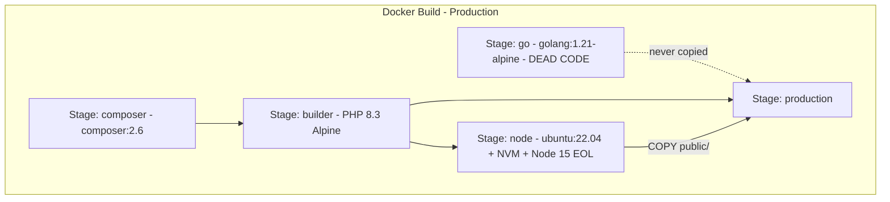

# Docker Build Optimization — turnoverbnb-web

**Owner:** Platform Team
**Timeline:** 2 sprints (~2 weeks)
**Estimated savings:** 8–15 minutes per production build
**Repository:** turnoverbnb-web

---

## Overview

The turnoverbnb-web production Dockerfile has accumulated significant inefficiencies: dead stages, broken layer caching, redundant tools, and build steps that belong in CI rather than in the image recipe. These issues add 8–15 minutes to every production build.

This document covers tactical fixes (DF-1, DF-3 through DF-10) that can be executed immediately, without waiting for CI/CD architectural decisions. The Node 15 → 18+ upgrade (DF-2) is intentionally excluded — it carries high risk due to deep coupling with legacy frontend dependencies and is tracked separately in [Frontend Build Modernization](frontend-build-modernization.md).

### Current Docker Multi-Stage Build



### Related Documents

- [CI/CD Architecture Decision](cicd-architecture-decision.md) — pipeline consolidation and reusable workflows
- [Frontend Build Modernization](frontend-build-modernization.md) — Node upgrade and Vite migration (DF-2)

---

## Pre-requisites (Blockers)

These must be resolved before starting Sprint 2. Sprint 1 (zero-risk items) can proceed without them.

### B1: Runner type — ephemeral or persistent?

Determines whether BuildKit cache mounts (DF-3) persist between builds or require registry-based caching (`cache-to=type=registry`). Run `docker info` on the self-hosted runner and check if `/var/lib/docker` survives between workflow runs.

**Action:** Platform team to verify runner lifecycle on `gcp-gh-runner` pool.

### B2: `php artisan export:messages-flat` file dependencies

DF-1 reorders `COPY` so that `composer install` runs before the application code is copied. The `export:messages-flat` command runs post-install and may depend on files beyond `vendor/`. Must confirm which app directories it reads.

**Action:** Trace the artisan command source code or run it locally with `strace`/`xdebug` to map file access.

---

## Confirmed Bottlenecks

### DF-1: `COPY . .` before `composer install` invalidates PHP dependency cache

**File:** `docker/production/Dockerfile` lines 73–93

**Problem:** The entire codebase is copied before `composer install`. Any change to any `.php` file invalidates the layer cache and forces re-download of all 77+ packages (including `aws/aws-sdk-php`, `google/apiclient`, `filament/filament`, `mongodb/laravel-mongodb`).

**Break risk:** Medium — `php artisan export:messages-flat` runs after `composer install` and needs app code. Blocked by pre-requisite B2.

**Fix:**

```dockerfile
COPY --chown=www-data:www-data composer.json composer.lock ./
RUN composer install --no-dev --optimize-autoloader --prefer-dist --no-interaction --no-scripts
COPY --chown=www-data:www-data . .
RUN composer dump-autoload -o && php artisan export:messages-flat
```

**Acceptance criteria:**
- `docker build` succeeds with no composer errors
- `php artisan export:messages-flat` produces identical output
- Build time drops by 1–3 min when only PHP code changes (no dependency changes)

**Estimated impact:** -1 to 3 min

---

### DF-3: Webpack cache disabled in production (391s per build)

**File:** `webpack.mix.js` lines 36–41

**Problem:** `cache: mix.inProduction() ? false : { type: "filesystem" }` forces full recompilation of 7 JS entry points + 1 SASS on every build. Combined with the lack of a BuildKit cache mount, no webpack output survives between Docker builds.

**Break risk:** Low — enabling filesystem cache does not change output. Requires BuildKit cache mount inside Docker.

**Fix (webpack.mix.js):**

```javascript
cache: {
    type: "filesystem",
    buildDependencies: {
        config: [__filename],
    }
}
```

**Fix (Dockerfile):**

```dockerfile
RUN --mount=type=cache,target=/var/www/html/node_modules/.cache \
    npm run prod
```

**Acceptance criteria:**
- First build produces identical assets (diff `public/js/` and `public/css/` hashes)
- Second build completes in under 120s (down from 391s)
- BuildKit cache mount works on runner (depends on B1)

**Estimated impact:** -4 to 5 min (391s → ~60–90s on incremental builds)

---

### DF-4: Go stage is dead code

**File:** `docker/production/Dockerfile` lines 4–8

**Problem:** The `go` stage compiles `s5cmd`, but there is no `COPY --from=go` in the production stage. The binary is not referenced in any PHP, shell, or config file in the repository. The codebase uses `s3cmd` (not `s5cmd`).

**Break risk:** None.

**Fix:** Delete lines 1–8 from the production Dockerfile.

**Acceptance criteria:**
- `docker build` succeeds
- No reference to `s5cmd` exists in the final image

**Estimated impact:** -10–20s + reduced complexity

---

### DF-5: Recursive `chown -R` in production stage

**File:** `docker/production/Dockerfile` line ~200

**Problem:** `chown -R www-data:www-data /var/www/html` traverses every file including `vendor/` (77+ packages). This is slow and creates a large extra layer. Previous `COPY` instructions already use `--chown=www-data:www-data`.

**Break risk:** Low.

**Fix:**

```dockerfile
RUN chmod -R 755 /var/www/html/storage /var/www/html/bootstrap/cache
```

**Acceptance criteria:**
- `docker build` succeeds
- Application boots correctly (`php artisan --version`)
- File permissions on `storage/` and `bootstrap/cache/` are correct

**Estimated impact:** -10–30s

---

### DF-6: `.env` leak into build context

**File:** `.dockerignore` lines 13–16

**Problem:** The `.env` exclusion lines are commented out. On self-hosted runners with persistent state, `.env` files may exist in the build directory and leak into the Docker context or image.

**Break risk:** None.

**Fix:**

```dockerignore
.env
.env.*
!.env.example
```

**Acceptance criteria:**
- `docker build` succeeds
- `.env` files are not present in any layer (verify with `docker run --rm $IMAGE ls -la /var/www/html/.env`)

**Estimated impact:** Security (secret leak prevention)

---

### DF-7: `COPY . .` in node stage copies unnecessary files

**File:** `docker/production/Dockerfile` line 151

**Problem:** `COPY . .` copies the entire codebase into the node stage, but `npm run prod` only needs `resources/`, webpack config files, and `package.json`. Any PHP-only change invalidates this layer.

**Break risk:** Medium — webpack may resolve relative paths that depend on the directory structure. Aliases in `webpack.mix.js` point to `resources/assets/js/`.

**Fix:**

```dockerfile
COPY webpack.mix.js webpack.mix.dashboard.js webpack.mix.marketing.js webpack.mix.public-cleaners.js ./
COPY resources/ resources/
COPY public/ public/
```

**Acceptance criteria:**
- `npm run prod` succeeds
- Asset output (hashes in `public/mix-manifest.json`) matches the full-COPY build
- Cache hit improves when only PHP files change

**Estimated impact:** Cache improvement

---

### DF-8: UglifyJS + Terser conflict (double minification)

**File:** `webpack.mix.dashboard.js`

**Problem:** `uglifyjs-webpack-plugin` is configured with `parallel: 8`, but Webpack 5 (via Laravel Mix 6) already uses `terser-webpack-plugin` internally. This causes double minification, plugin conflicts, and extra build time.

**Break risk:** Low — Terser is UglifyJS's successor and produces equivalent or better output.

**Fix:** Remove `uglifyjs-webpack-plugin` from `package.json` and the `uglify: { parallel: 8 }` configuration from webpack.mix files.

**Acceptance criteria:**
- `npm run prod` succeeds
- Bundle sizes are within 5% of previous output
- No runtime JS errors in staging

**Estimated impact:** -30–60s

---

### DF-9: Sentry release management inside Docker build (2–5 min)

**File:** `docker/production/Dockerfile` lines 155–185 and `docker/production/tools/sentry.sh`

**Problem:** When `SENTRY_RELEASE_ENABLED=1` (production builds via `prd-image.yml`), the Dockerfile installs Sentry CLI via npm, creates releases in 2 projects, injects debug IDs into sourcemaps, uploads them, and finalizes releases — all blocking the Docker builder.

**Break risk:** Medium — moving Sentry to a post-build CI step requires sourcemaps to be extractable from the built image. This is an integration point with the CI/CD Architecture track (Doc 2).

**Fix:**

```yaml
- name: Extract sourcemaps
  run: docker cp $(docker create $IMAGE):/var/www/html/public ./public-assets
- name: Sentry release
  run: ./docker/production/tools/sentry.sh $BUILD_TAG
```

**Acceptance criteria:**
- Docker build completes without Sentry operations
- Sourcemaps are correctly uploaded via CI step
- Sentry release appears with correct commit and sourcemap associations

**Estimated impact:** -2 to 5 min (moved to parallel CI step)

---

### DF-10: `barryvdh/laravel-ide-helper` in production require

**File:** `composer.json`

**Problem:** `barryvdh/laravel-ide-helper` is in `require` instead of `require-dev`. It gets installed in the production image despite being a development-only tool. The `post-autoload-dump` scripts only run `ide-helper:generate` and `ide-helper:meta` when `APP_ENV=local`.

**Break risk:** Medium — if `IdeHelperServiceProvider` is registered unconditionally in `config/app.php`, moving the package to `require-dev` will cause a class-not-found error in production.

**Fix:** Move to `require-dev` and add a conditional check in `config/app.php`.

**Acceptance criteria:**
- `composer install --no-dev` succeeds without the package
- Application boots in production mode (`APP_ENV=production`) without errors
- IDE helper commands still work in local development

**Estimated impact:** Marginal (fewer packages in production image)

---

## PR Execution Order

PRs are grouped by risk level. Each PR must pass the smoke test before merge.

### Phase 1: Zero Risk

| PR | Items | Changes |
|----|-------|---------|
| PR-1 | DF-4 | Remove Go stage from Dockerfile |
| PR-2 | DF-6 | Uncomment `.env` exclusion in `.dockerignore` |

### Phase 2: Low Risk

| PR | Items | Changes |
|----|-------|---------|
| PR-3 | DF-5 | Replace `chown -R` with targeted `chmod` |
| PR-4 | DF-8 | Remove `uglifyjs-webpack-plugin` and config |
| PR-5 | DF-3 | Enable webpack filesystem cache + BuildKit cache mount (blocked by B1) |

### Phase 3: Medium Risk

| PR | Items | Changes |
|----|-------|---------|
| PR-6 | DF-1 | Reorder `COPY` for Composer cache optimization (blocked by B2) |
| PR-7 | DF-7 | Selective `COPY` in node stage |
| PR-8 | DF-9 | Move Sentry release out of Docker build (integration point with CI/CD track) |
| PR-9 | DF-10 | Move `ide-helper` to `require-dev` |

---

## Smoke Test Definition

Every DF-* PR must pass this standardized validation before merge:

```bash
#!/bin/bash
set -euo pipefail

IMAGE="turnoverbnb-web:smoke-test-$(git rev-parse --short HEAD)"

echo "=== Building image ==="
DOCKER_BUILDKIT=1 docker build -t "$IMAGE" -f docker/production/Dockerfile .

echo "=== Runtime validation ==="
docker run --rm "$IMAGE" php artisan --version
docker run --rm "$IMAGE" php -m | grep -q "pdo_mysql"
docker run --rm "$IMAGE" test -d /var/www/html/vendor
docker run --rm "$IMAGE" test -f /var/www/html/public/mix-manifest.json
docker run --rm "$IMAGE" stat -c '%U' /var/www/html/storage | grep -q "www-data"

echo "=== Checking no .env leaked ==="
docker run --rm "$IMAGE" test ! -f /var/www/html/.env

echo "=== All checks passed ==="
```

For DF-3, DF-7, and DF-8 (asset-related changes), add:

```bash
echo "=== Asset hash comparison ==="
docker run --rm "$IMAGE" cat /var/www/html/public/mix-manifest.json
```

Compare `mix-manifest.json` output against the current production image to verify asset integrity.

---

## Systemic Risks

### R1: Blast Radius — Batching Too Many Dockerfile Changes

**Risk:** Sprint 2 applies multiple changes to the same Dockerfile. A subtle regression (wrong asset output, missing package at runtime) may only surface after production deploy.

**Probability:** Medium | **Impact:** High

**Mitigation:**
- Merge PRs one at a time, in risk order (Phase 1 → 2 → 3).
- Run the smoke test on every PR. Do not batch multiple DF-* items into one PR.
- After each merge, trigger a staging deploy and verify the application before proceeding to the next PR.

### R4: Runner Ephemerality

**Risk:** BuildKit cache mounts (DF-3) and Docker layer caching assume persistent local storage on the runner. If runners are ephemeral (auto-scaled VMs that get destroyed after each run), these caches provide zero benefit.

**Probability:** Medium | **Impact:** High (DF-3 is the highest-ROI item)

**Mitigation:**
- If runners are ephemeral: use `cache-to=type=registry,ref=...` and `cache-from=type=registry,ref=...` instead of local cache mounts. The `build-and-push` action in `github-actions` already supports this.
- If runners are persistent: cache mounts work as designed. Add a scheduled `docker system prune` to prevent disk exhaustion.

---

## Impact Summary

| ID | Bottleneck | Estimated Savings | Break Risk |
|----|-----------|-------------------|------------|
| DF-3 | Webpack cache disabled | -4 to 5 min | Low |
| DF-1 | Composer COPY before deps | -1 to 3 min | Medium |
| DF-9 | Sentry inside Docker build | -2 to 5 min | Medium |
| DF-8 | UglifyJS + Terser conflict | -30 to 60s | Low |
| DF-5 | Recursive chown -R | -10 to 30s | Low |
| DF-4 | Dead Go stage | -10 to 20s | None |
| DF-7 | Selective COPY in node | Cache improvement | Medium |
| DF-6 | .env in build context | Security | None |
| DF-10 | ide-helper in production | Marginal | Medium |

**Total estimated savings: 8–15 minutes per build** (excluding DF-2, tracked in [Frontend Build Modernization](frontend-build-modernization.md))

---

## Timeline

| Sprint | Duration | Scope |
|--------|----------|-------|
| Sprint 1 | 1 week | Phase 1 (DF-4, DF-6) + resolve pre-requisites B1/B2 |
| Sprint 2 | 1 week | Phase 2 (DF-5, DF-8, DF-3) + Phase 3 (DF-1, DF-7, DF-9, DF-10) |

---

## Jira Hierarchy Suggestion

### Initiative: Reduce turnoverbnb-web Docker Build Time

Platform initiative to cut production Docker build time by 8–15 minutes through layer cache optimization, dead code removal, and build restructuring.

### Epic: Docker Build Optimization — turnoverbnb-web

Apply DF-1 through DF-10 (excluding DF-2) to the production Dockerfile with zero-downtime migration.

- **Story: Remove dead code and fix security issues (DF-4, DF-6)**
  Zero-risk changes: remove Go stage, uncomment .env in .dockerignore.
  - Task: Remove Go stage from production Dockerfile (DF-4)
  - Task: Uncomment .env exclusion in .dockerignore (DF-6)
  - Task: Create and validate smoke test script

- **Story: Optimize Docker layer caching (DF-1, DF-5, DF-7)**
  Reorder COPY for Composer cache, eliminate recursive chown, selective COPY in node stage.
  - Task: Reorder composer.json/lock COPY before app code (DF-1)
  - Task: Remove recursive chown -R (DF-5)
  - Task: Selective COPY in node stage (DF-7)
  - Task: Validate `export:messages-flat` with new COPY order

- **Story: Enable webpack persistent cache (DF-3, DF-8)**
  Enable filesystem cache in webpack.mix.js + BuildKit cache mount; remove duplicate UglifyJS plugin.
  - Task: Enable webpack filesystem cache (DF-3)
  - Task: Add BuildKit cache mount to Dockerfile
  - Task: Remove uglifyjs-webpack-plugin (DF-8)
  - Task: Compare bundle output before/after

- **Story: Move Sentry release out of Docker build (DF-9)**
  Extract Sentry CLI install and sourcemap upload to a post-build CI step.
  - Task: Create sourcemap extraction step in workflow
  - Task: Move sentry.sh execution to workflow step
  - Task: Validate sourcemaps upload and release creation

- **Story: Move ide-helper to require-dev (DF-10)**
  - Task: Move package in composer.json from require to require-dev
  - Task: Add conditional provider registration in config/app.php
  - Task: Validate production boot without the package
